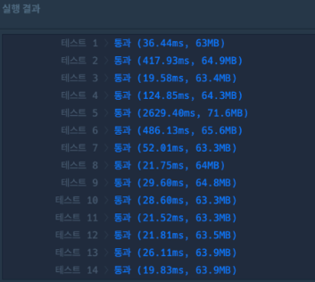
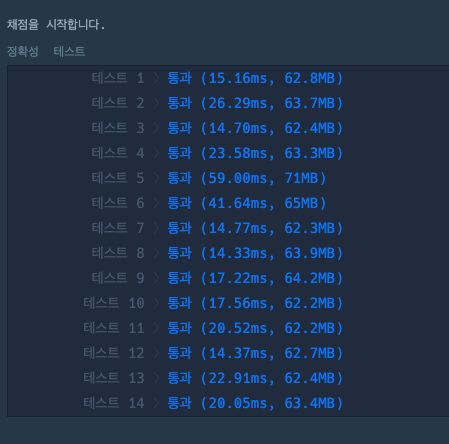

# 다리를 지나는 트럭

## 첫번째 풀이
```kotlin
import java.util.*

class Solution {
    fun solution(bridge_length: Int, weight: Int, truck_weights: IntArray): Int {
        var answer = 0
        val bridgeQueue: Queue<Int> = LinkedList(IntArray(bridge_length) {0}.toList())
        val waitQueue: Queue<Int> = LinkedList<Int>(truck_weights.toList())

        while (bridgeQueue.isNotEmpty()) {
            bridgeQueue.poll()
            if (waitQueue.isNotEmpty()) {
                if (bridgeQueue.sum() <= weight - waitQueue.peek()) {
                    bridgeQueue.add(waitQueue.poll())
                } else {
                    bridgeQueue.add(0)
                }
            }
            answer++
        }
        return answer
    }
}


```


## 두번째 풀이
```kotlin
import java.util.*

class Solution {
    fun solution(bridge_length: Int, weight: Int, truck_weights: IntArray): Int {
        var answer = 0
        val bridgeQueue: Queue<Int> = LinkedList(IntArray(bridge_length) {0}.toList())
        var bridgeTotalWeight = 0
        val waitQueue: Queue<Int> = LinkedList<Int>(truck_weights.toList())

        while (bridgeQueue.isNotEmpty()) {
            bridgeTotalWeight -= bridgeQueue.poll()
            if (waitQueue.isNotEmpty()) {
                if (bridgeTotalWeight <= weight - waitQueue.peek()) {
                    bridgeTotalWeight += waitQueue.peek()
                    bridgeQueue.add(waitQueue.poll())
                } else {
                    bridgeQueue.add(0)
                }
            }
            answer++
        }
        return answer
    }
}


```

