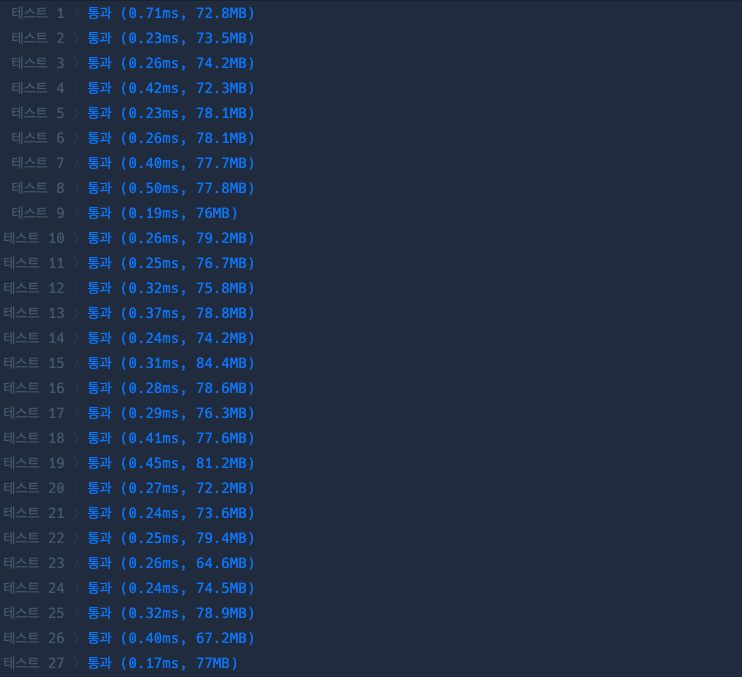

# 의상

## 첫 번째 풀이
1. 의상 종류 별로 개수를 저장하는 hash map을 생성한다.
2. 의상 종류 별 개수들을 1을 더하고 모두 곱한다.
   - 1을 더하는 이유: 해당 의상을 입지 않을 경우도 있기 때문
3. 곱한 값에 1을 뺀다.
   - 1을 빼는 이유: 모든 의상을 입지 않은 경우를 제외하기 위해

```java
import java.util.*;

class Solution {
    public int solution(String[][] clothes) {
        int answer = 1;
        Map<String, Integer> map = new HashMap<>();
        
        for (String[] clothe : clothes) {
            if (map.containsKey(clothe[1])) {
                map.put(clothe[1], map.get(clothe[1]) + 1);
                continue;
            }
            map.put(clothe[1], 1);
        }

        for (int count : map.values()) {
            System.out.println(count);
            answer *= count + 1;
        }
        return answer - 1;
    }
}
```



## 두 번째 풀이

- java stream으로 풀이
- 코드는 간결해졌지만, 성능적으로 손해를 봤다.

```java
import java.util.*;

import static java.util.stream.Collectors.counting;
import static java.util.stream.Collectors.groupingBy;

class Solution {
    public int solution(String[][] clothes) {
        int answer = Arrays.stream(clothes)
                .collect(groupingBy(clothe -> clothe[1], counting()))
                .values()
                .stream()
                .reduce(1L, (a, b) -> a * (b + 1))
                .intValue();
        return answer - 1;
    }
}
```

