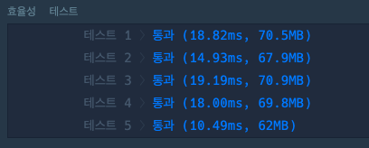
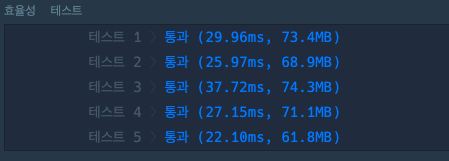

## 주식 가격

### 첫 번째 풀이

- 시간복잡도: O(n^2)

```java
class Solution {
    public int[] solution(int[] prices) {
        int[] answer = new int[prices.length];
        for (int i = 0; i < prices.length; i++) {
            for (int j = i + 1; j < prices.length; j++) {
                answer[i] += 1;
                if (prices[i] > prices[j]) {
                    break;
                }
            }
        }
        return answer;
    }
}
```




### 두 번째 풀이

- 시간복잡도: O(n)

```java
import java.util.Stack;

class Solution {
    public int[] solution(int[] prices) {
        int length = prices.length;
        int[] answer = new int[length];

        Stack<Integer> stack = new Stack<>();

        for (int i = 0; i < length; i++) {
            while (!stack.isEmpty() && prices[i] < prices[stack.peek()]) {
                int idx = stack.pop();
                answer[idx] = i - idx;
            }
            stack.push(i);
        }

        while (!stack.isEmpty()) {
            int idx = stack.pop();
            answer[idx] = length - 1 - idx;
        }

        return answer;
    }
}
```

